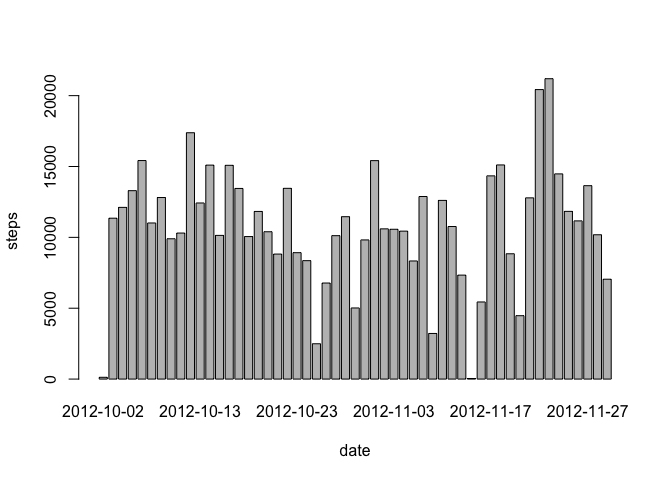
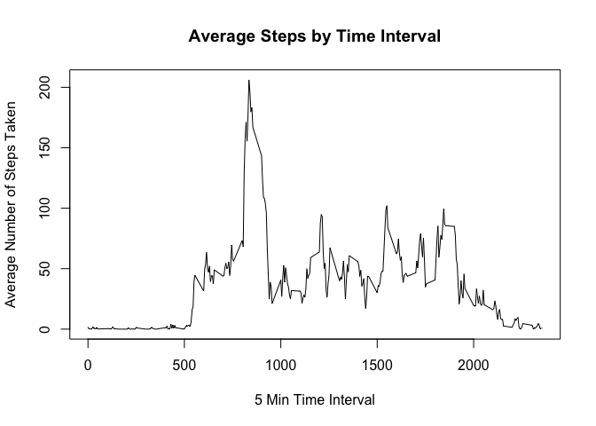
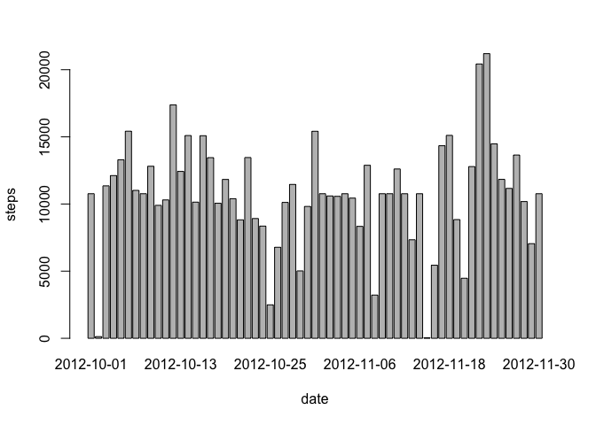
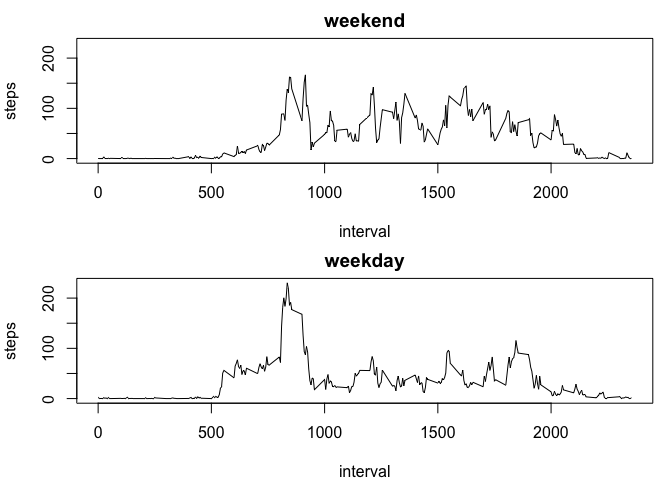

# Reproducible Research: Peer Assessment 1

by Yiyang Hu
Sunday, July 31st, 2016

## Loading and preprocessing the data

Load the data then process date variable format to POSIXct

```r
actData <- read.csv("activity.csv")
actData$date <- as.POSIXct(actData$date)
head(actData)
```

```
##   steps       date interval
## 1    NA 2012-10-01        0
## 2    NA 2012-10-01        5
## 3    NA 2012-10-01       10
## 4    NA 2012-10-01       15
## 5    NA 2012-10-01       20
## 6    NA 2012-10-01       25
```


## What is mean total number of steps taken per day?


1.Make a histogram of the total number of steps taken each day


```r
totalSteps<-aggregate(steps~date,data=actData,FUN=sum)
barplot(totalSteps$steps,names.arg =totalSteps$date,xlab="date",ylab="steps")
```

\

2.Calculate and report the mean and median total number of steps taken per day


```r
mean(totalSteps$steps)
```

```
## [1] 10766.19
```

```r
median(totalSteps$steps)
```

```
## [1] 10765
```
## What is the average daily activity pattern?

1.Make a time series plot (i.e. type = "l") of the 5-minute interval (x-axis) and the average number of steps taken, averaged across all days (y-axis)


```r
stepsInterval <- aggregate(steps~interval, data = actData, FUN = mean)
plot(stepsInterval,type="l",main="Average Steps by Time Interval", xlab="5 Min Time Interval", ylab="Average Number of Steps Taken")
```

\
2.Which 5-minute interval, on average across all the days in the dataset, contains the maximum number of steps?


```r
maxInterval <- stepsInterval[which.max(stepsInterval$steps),]$interval
```
So the interval at 835 contains the maximum number of steps

## Imputing missing values

Note that there are a number of days/intervals where there are missing values (coded as NA). The presence of missing days may introduce bias into some calculations or summaries of the data.

1.Calculate and report the total number of missing values in the dataset (i.e. the total number of rows with NAs)


```r
sum(is.na(actData$steps))
```

```
## [1] 2304
```

2.Devise a strategy for filling in all of the missing values in the dataset. The strategy does not need to be sophisticated. For example, you could use the mean/median for that day, or the mean for that 5-minute interval, etc.

=> I will just use the mean for that 5-minute interval for the missing value.

3.Create a new dataset that is equal to the original dataset but with the missing data filled in.


```r
# create a data set merged by interval, using suffix .y to identify which dataset it comes from
tempData <-merge(actData,stepsInterval,by="interval",suffixes=c("",".y"))

# select all NA values into an array
na <- is.na(tempData$steps)

# replace missing values to the mean for the same 5-minute interval
tempData$steps[na] <-tempData$steps.y[na]

# select only the first 3 columns (others are duplicates)
dataNoNa <-tempData[,c(1:3)]
```

4.Make a histogram of the total number of steps taken each day and Calculate and report the mean and median total number of steps taken per day. Do these values differ from the estimates from the first part of the assignment? What is the impact of imputing missing data on the estimates of the total daily number of steps?


```r
stepsDay <-aggregate(steps ~ date, data = dataNoNa, FUN = sum)
barplot(stepsDay$steps,names.arg=stepsDay$date,xlab="date",ylab="steps",ylim=c(0,20000))
```

\

```r
meanDay <- mean(stepsDay$steps)
meanDay
```

```
## [1] 10766.19
```

```r
medianDay <- median(stepsDay$steps)
medianDay
```

```
## [1] 10766.19
```
The mean values are the same as before since we put mean for that specific 5-min interval there, so take the new average would remain the same. Median value is a tiny bit different depending where the NAs were.

## Are there differences in activity patterns between weekdays and weekends?

1. Create a new factor variable in the dataset with two levels -- "weekday" and "weekend" indicating whether a given date is a weekday or weekend day.


```r
dataNoNa$dayType <-ifelse(weekdays(dataNoNa$date) %in% c("Saturday","Sunday"),"weekend","weekday")
```

2. Make a panel plot containing a time series plot (i.e. type = "l") of the 5-minute interval (x-axis) and the average number of steps taken, averaged across all weekday days or weekend days (y-axis). 


```r
par(mfrow=c(2,1),mar=c(4,4,2,1))

for (type in c("weekend","weekday")) {
        
      stepsMean<- aggregate(steps ~ interval, data= dataNoNa, subset=dataNoNa$dayType == type, FUN = mean)
      plot(stepsMean,type="l", main=type, ylim=c(0,230))
}
```

\

